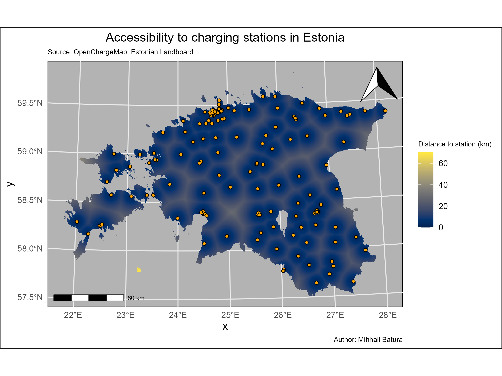
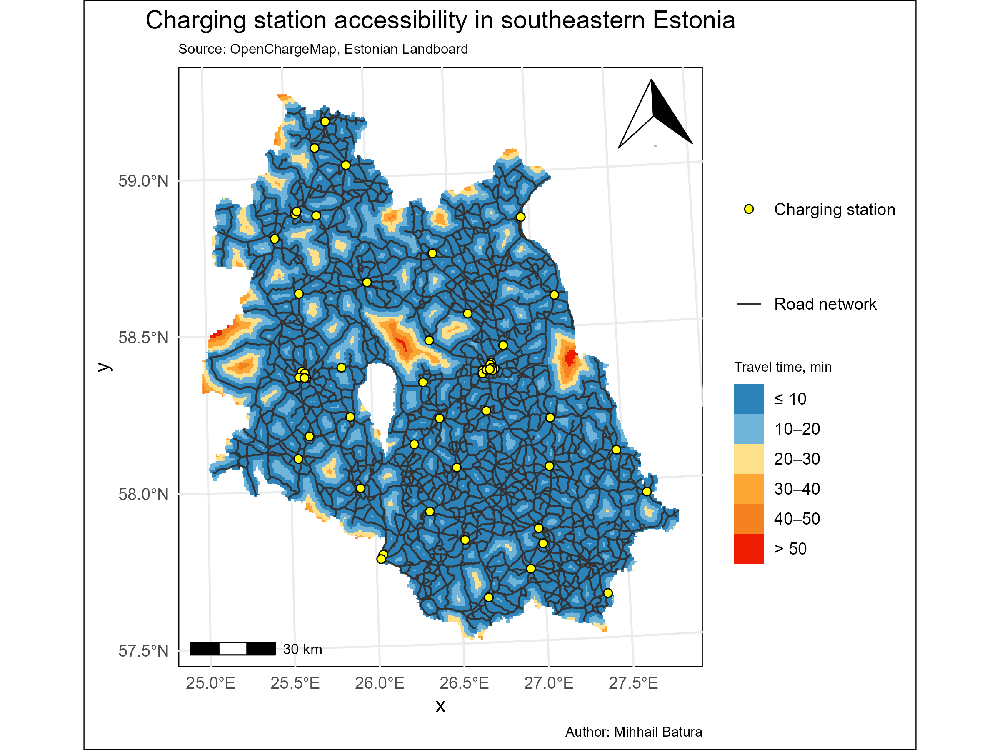

# Accessibility of EV charging stations in Estonia

**Author:** Mihhail Batura

## Overview

This project evaluates the accessibility of electric vehicle (EV) charging stations in Estonia using two spatial approaches:

1. **Euclidean distance** to the nearest station (whole country)
2. **Travel time** to the nearest station (southeastern Estonia), accounting for road network and rivers as barriers.

## Results

### Distance to nearest station (Estonia)

### Travel time to nearest station (southeastern Estonia)

## Workflow

1. **Distance matrix (R)** – `code/Batura_fproj1.R`  
   Creates a raster of Euclidean distance to the nearest station.

2. **Speed raster preparation (R)** – `code/Batura_fproj2.R`  
   Builds a speed raster (m/min) based on road classes and rivers as barriers.  
   *Fully automated – no manual GIS editing.*

3. **Travel time calculation (Python)** – `code/Batura_fproj3.ipynb`  
   Cost‑distance analysis using Dijkstra's algorithm (`MCP_Geometric`).

4. **Final map (R)** – `code/Batura_fproj4.R`  
   Loads travel time raster, classifies, and produces the final map.

## Technologies

- **R**: `sf`, `terra`, `dplyr`, `ggplot2`, `ggspatial`
- **Python**: `rasterio`, `numpy`, `skimage.graph`, `geopandas`
- **Data sources**: OpenChargeMap API, Estonian Land Board, university course data

## Full report

[Download PDF report](docs/MB_fproj.pdf)

## Author

Mihhail Batura – [GitHub](https://github.com/MihBat)
